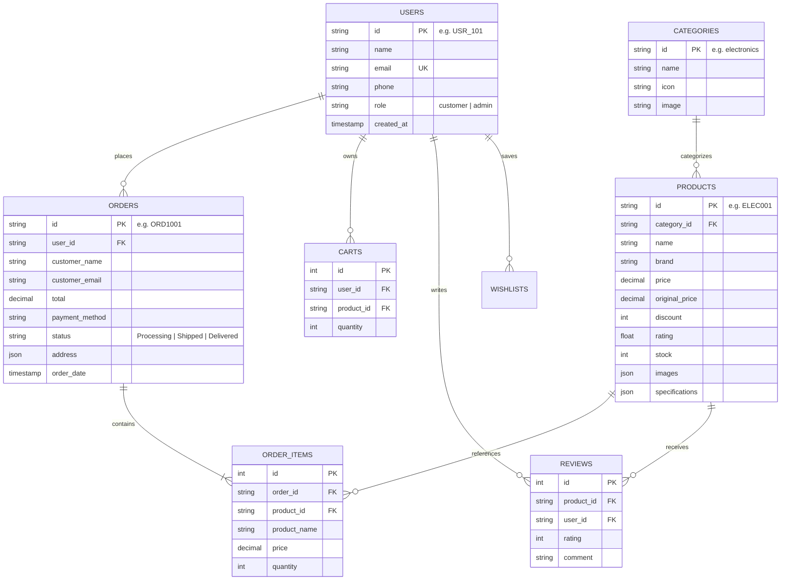

# 📊 KartHub Database — Entity-Relationship Diagram (ERD)

This diagram visualizes the relational connections between the tables in KartHub.

```mermaid
erDiagram
    USERS ||--o{ ORDERS : places
    USERS ||--o{ CARTS : owns
    USERS ||--o{ REVIEWS : writes
    USERS ||--o{ WISHLISTS : saves
    
    ORDERS ||--|{ ORDER_ITEMS : contains
    PRODUCTS ||--o{ ORDER_ITEMS : references
    CATEGORIES ||--o{ PRODUCTS : categorizes
    PRODUCTS ||--o{ REVIEWS : receives

    USERS {
        string id PK "e.g. USR_101"
        string name
        string email UK
        string phone
        string role "customer | admin"
        timestamp created_at
    }

    CATEGORIES {
        string id PK "e.g. electronics"
        string name
        string icon
        string image
    }

    PRODUCTS {
        string id PK "e.g. ELEC001"
        string category_id FK
        string name
        string brand
        decimal price
        decimal original_price
        int discount
        float rating
        int stock
        json images
        json specifications
    }

    ORDERS {
        string id PK "e.g. ORD1001"
        string user_id FK
        string customer_name
        string customer_email
        decimal total
        string payment_method
        string status "Processing | Shipped | Delivered"
        json address
        timestamp order_date
    }

    ORDER_ITEMS {
        int id PK
        string order_id FK
        string product_id FK
        string product_name
        decimal price
        int quantity
    }

    CARTS {
        int id PK
        string user_id FK
        string product_id FK
        int quantity
    }

    REVIEWS {
        int id PK
        string product_id FK
        string user_id FK
        int rating
        string comment
    }
```
